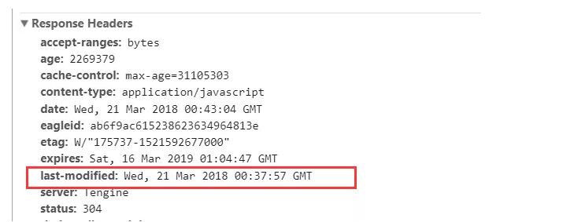
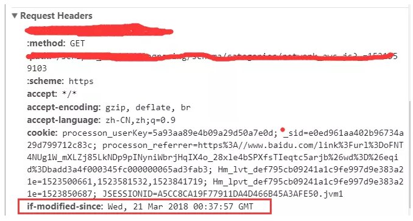
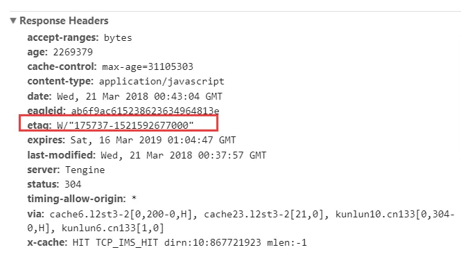
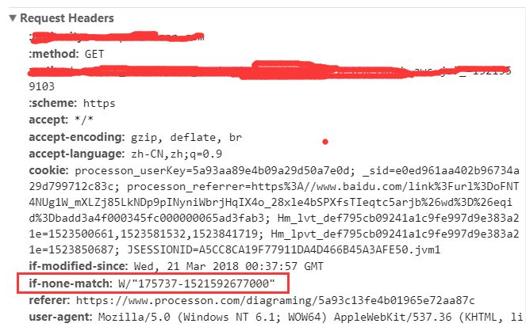

# Last-Modified & If-Modified-Since

1. 服务器通过 Last-Modified 字段告知客户端，资源最后一次被修改的时间，例如

Last-Modified: Mon, 10 Nov 2018 09:10:11 GMT

2. 浏览器将这个值和内容一起记录在缓存数据库中。

3. 下一次请求相同资源时时，浏览器从自己的缓存中找出“不确定是否过期的”缓存。因此在请求头中将上次的 Last-Modified 的值写入到请求头的 If-Modified-Since 字段

4. 服务器会将 If-Modified-Since 的值与 Last-Modified 字段进行对比。如果相等，则表示未修改，响应 304；反之，则表示修改了，响应 200 状态码，并返回数据。

但是他还是有一定缺陷的：

- 如如果资源被修改了，最后修改时间变了，但是内容没有变，会重新请求资源文件。

# Etag & If-None-Match

为了解决上述问题，出现了一组新的字段 Etag 和 If-None-Match

Etag是服务器响应请求时，返回当前资源文件的一个唯一标识(由服务器生成)，如下。

If-None-Match是客户端再次发起该请求时，携带上次请求返回的唯一标识Etag值，通过此字段值告诉服务器该资源上次请求返回的唯一标识值。服务器收到该请求后，发现该请求头中含有If-None-Match，则会根据If-None-Match的字段值与该资源在服务器的Etag值做对比，一致则返回304，代表资源无更新，继续使用缓存文件；不一致则重新返回资源文件，状态码为200，如下。

**Etag / If-None-Match优先级高于Last-Modified / If-Modified-Since，同时存在则只有Etag / If-None-Match生效。**

缺点：实际应用中由于Etag的计算是使用算法来得出的，而算法会占用服务端计算的资源。